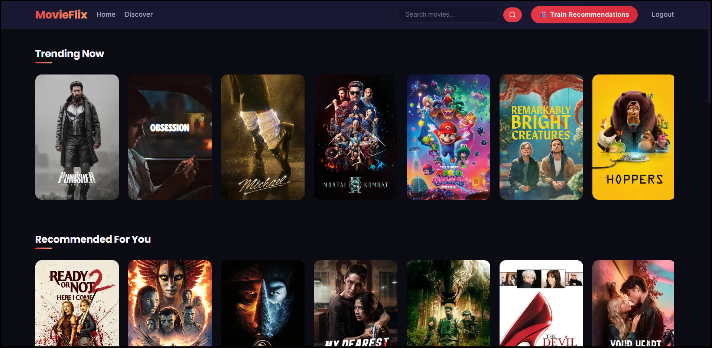
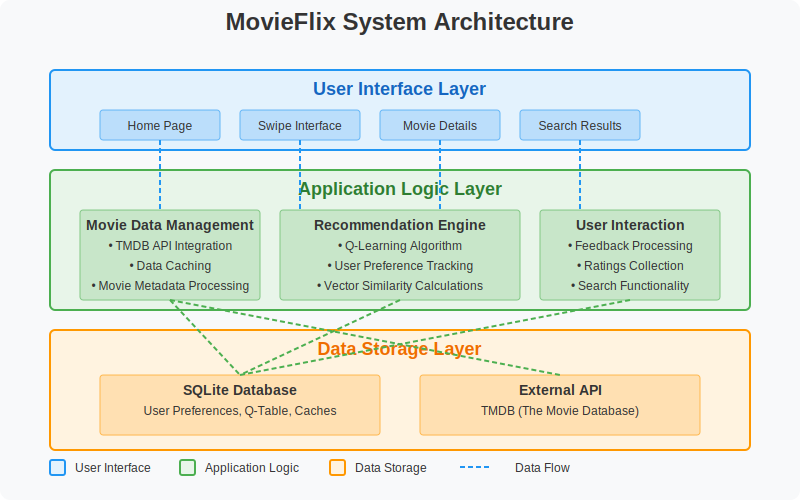

# 🎬 MovieFlix — Advanced AI-Powered Movie Discovery & Personalized Recommendation Engine

<p align="center">
  
</p>

<p align="center">
  <a href="https://hsinha2004.pythonanywhere.com" target="_blank">
    
  </a>
</p>

> [!NOTE]
> MovieFlix is a premium, full-stack, production-hardened web application designed to recommend highly personalized movie choices. It achieves custom recommendation profiles through **reinforcement learning (Q-Learning)** and isolates individual user tastes.

---

## 🌟 Key Modernizations & Core Features

*   **👥 Profile-Isolated AI Recommendations:** The AI recommendation engine is fully decoupled. The mathematical **Q-learning vectors** are stored per-user, preventing state collisions and tailoring specific suggestions unique to each individual profile.
*   **🎨 Unified Modern Design System:** A beautifully crafted, high-contrast visual interface utilizing a consistent palette (`--primary: #e63946`, `--background: #0b0b14`), custom Google fonts (Poppins & Inter), glassmorphism styles, fluid hover scales, and responsive grids across all views.
*   **🔒 Netflix-Style Auth Flow:** Implements robust secure session handling for Sign-Up, Log-In, and Landing pages with strict routing policies, protection against duplicate registrations, and visual flash alerts.
*   **⚙️ Bulletproof API Resilience:** Leverages optimized `requests.Session()` pools equipped with smart retry strategies (`Retry(total=3, backoff_factor=1)`) to handle TMDB API rate-limits gracefully.
*   **⚡ Sub-millisecond Cache Layers:** Fast responses via Python’s memory cache (`@lru_cache`) paired with an indexed database cache (`movie_cache`) to store movie details and query outputs, reducing redundant API trips.

---

## 🚀 Quick Setup & Installation

### 1. Prerequisites
- Python 3.8+
- Active internet connection (for TMDB API integration)

### 2. Set Up Virtual Environment
```bash
# Clone the repository
git clone <your-repository-url>
cd MovieFlix

# Create virtual environment
python -m venv .venv

# Activate it (Windows)
.venv\Scripts\activate

# Activate it (Mac/Linux)
source .venv/bin/activate
```

### 3. Install Dependencies
```bash
pip install -r requirements.txt
```

### 4. Configure Environment Variables
Copy `.env.example` to `.env` and fill in your keys:
```bash
cp .env.example .env
```
Ensure your `.env` contains:
```env
FLASK_SECRET_KEY=your_secure_flask_secret_key
TMDB_API_KEY=your_tmdb_v3_api_key
```

### 5. Running the Platform
```bash
python app.py
```
Open your browser and navigate to `http://127.0.0.1:5000` to begin.

---

## 📁 Repository Structure

```
├── .env.example         # Template for environment configuration
├── .gitignore           # Python, virtualenv, and database ignore rules
├── app.py               # Core Flask application, auth routes, and AI logic
├── requirements.txt     # Locked production dependencies
├── wsgi.py              # Entry point for production servers (Gunicorn/Waitress)
├── static/              # Assets, styles, and front-end scripts
│   ├── style.css        # Unified modern CSS design system
│   └── js/              # Interactivity handlers (swipe, search)
└── templates/           # Server-side HTML blueprints
    ├── base.html        # Shared master template
    ├── landing.html     # Cinematic brand landing page
    ├── login.html       # Profile login
    ├── register.html    # Profile registration
    ├── recommendations.html # Main dashboard
    ├── swipe.html       # AI discover/swipe training view
    ├── search_results.html  # Search grid
    ├── movie_details.html   # Detailed analytics and scenes
    └── error.html       # User-friendly error boundary page
```

---

## 🏛️ System Architecture

<p align="center">
  
</p>

The system follows a standard, decoupled layered structure:
1.  **Presentation Layer:** Dynamic glassmorphic front-end (HTML5/CSS3/Vanilla JS) requesting recommendations via AJAX.
2.  **Service/Logic Layer:** Multi-user authentication guards, TMDB API connection handlers, local database query operations, and reinforcement Q-learning preference scoring.
3.  **Data Persistence Layer:** SQLite database containing encrypted authentication details, cached movie items, and profile-isolated Q-values.

---

## 🤖 The AI Recommendation Pipeline

The engine leverages **Reinforcement Q-Learning**:
1.  **Movie Vector Space:** Every title is converted into a 15-dimensional numeric array (mapping genres, rating, release era, and familiar creators).
2.  **State-Action Transitions:** 
    - A **Swipe Right** or **5-Star Rating** triggers a reward ($R = +1$), shifting the user's vector closer to the movie's coordinates.
    - A **Swipe Left** or **Poor Rating** triggers a penalty ($R = -1$), shifting the user profile away from that feature set.
3.  **Exploitation vs. Exploration:** The recommender queries both top genres (exploitation) and popular baseline discovery movies (exploration) to guarantee serendipitous, fresh recommendations without bubble stagnation.

---

## 🔒 Production Security Checklist

-   [x] Session credentials cryptographically signed using AES-256.
-   [x] Cache invalidation automatically synced during taste transitions.
-   [x] Local credentials stored using cryptographic password hashing (`pbkdf2:sha256`).
-   [x] Database query security utilizing parameter binding to block SQL Injection vectors.

---

## 🛡️ License

This project is licensed under the MIT License - see the `LICENSE` file for details.